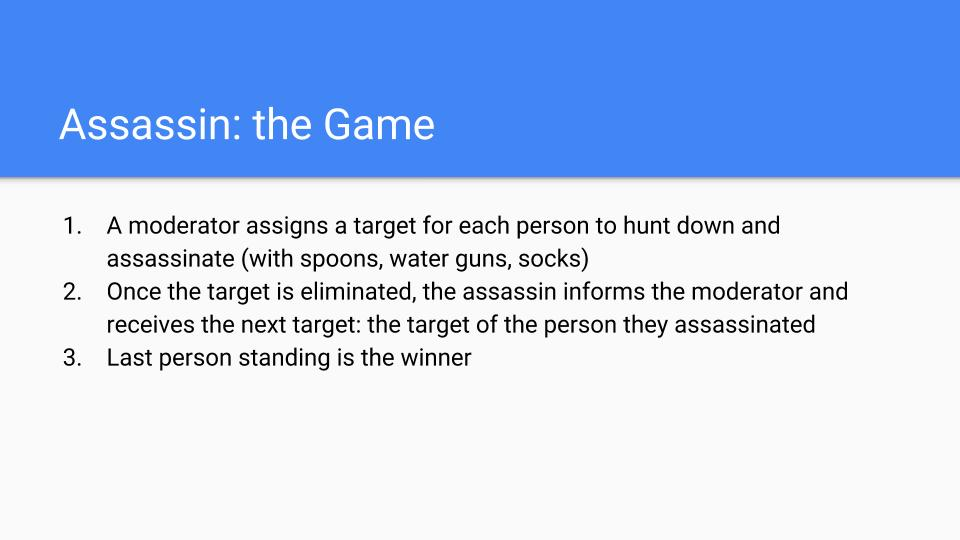
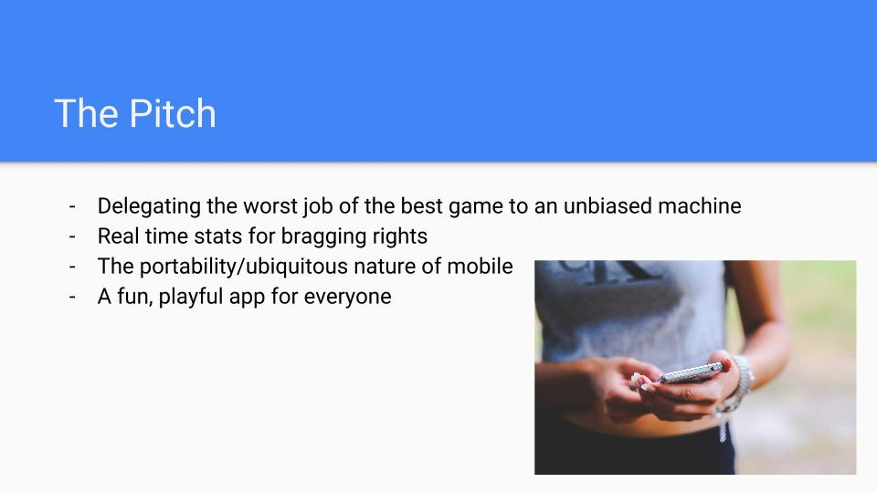

# Snapsassin

Android app to moderate and play Assassin games using face recognition.

Like the live-action game, Assassin, but moderated by a mobile app. No one has to sit out to moderate the game--Everyone can play! Rather than shooting each other with squirt guns or throwing dirty socks around, this game is played with your phone camera. Snap a photo of your target and their identity will be verified using face recognition. If that's the right person, you've successfully assassinated your target!

An Android app that uses Firebase realtime database, Firebase storage, Facebook auth, Microsoft Face API, and a simple Node.js backend (see repo called snap_server).

### TODO:
- Firebase push notifications.
- Revamp the login system so its not hacky and uses more than just Facebook.
- Implement veto system to veto cheats, which may be possible if someone takes a photo of a photo of their target.
- Display history of photos so that everyone can verify that the snap was legitimate.
- Implement a feed for an event logs, like "Game has started", or "____ has been eliminated."